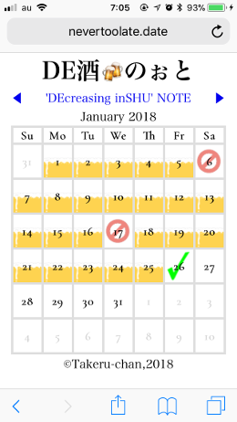
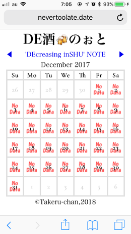

# DeShu-Note

## What's this? | これはなに？

休肝日を管理するWebアプリです。  

## Usage | つかいかた

iPhoneのブラウザでアクセスします。  

 

phpが動作するWebサーバーのドキュメントルート以下にプログラムファイルdeshu.phpを配置します。  

プログラムファイル配置ディレクトリ中のデータディレクトリ「deshu-note」下にyyyymm.deshuというファイル名のデータを配置します。  

yyyymmdd.activeというファイルがある場合、その日付以前の年月は記録なし扱いとなります。  

- \[prog_dir\]
    - deshu.php
    - \[deshu-note\]
        - 20180101.active
        - 201801.deshu
        - ...

ファイルフォーマットはdd:statusの羅列。
休肝日はdry、酒量が多い日はhigh、普通の日はmid、少ない日はlowを指定します。  

```
01:mid
02:mid
...
06:dry
```

## License

This code has released under the MIT license.  
[http://opensource.org/licenses/MIT](http://opensource.org/licenses/MIT)

## TODO list

- [ ] 日々の飲酒量を管理
- [ ] データベース対応
